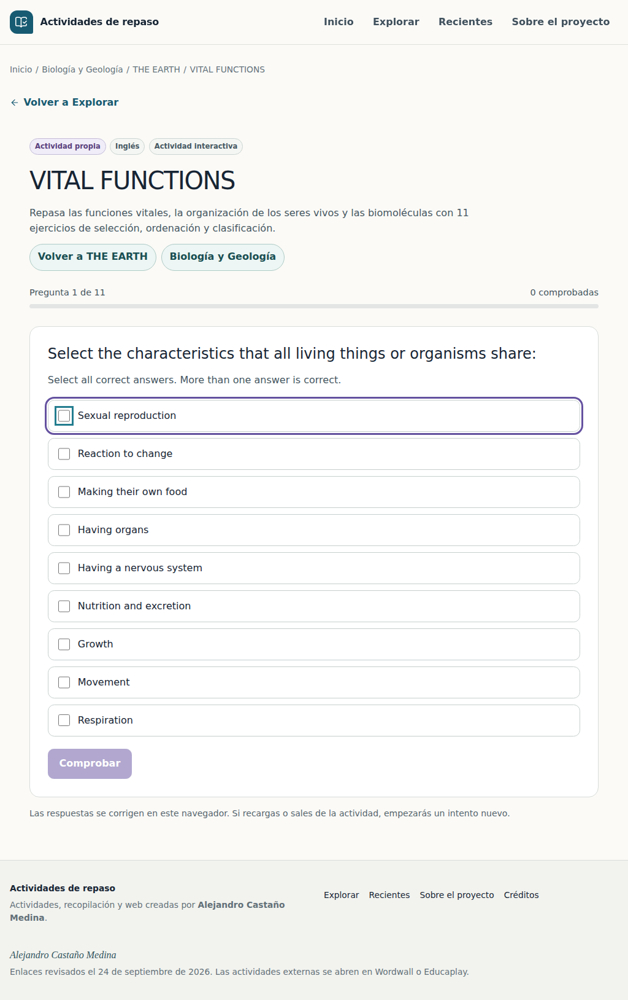
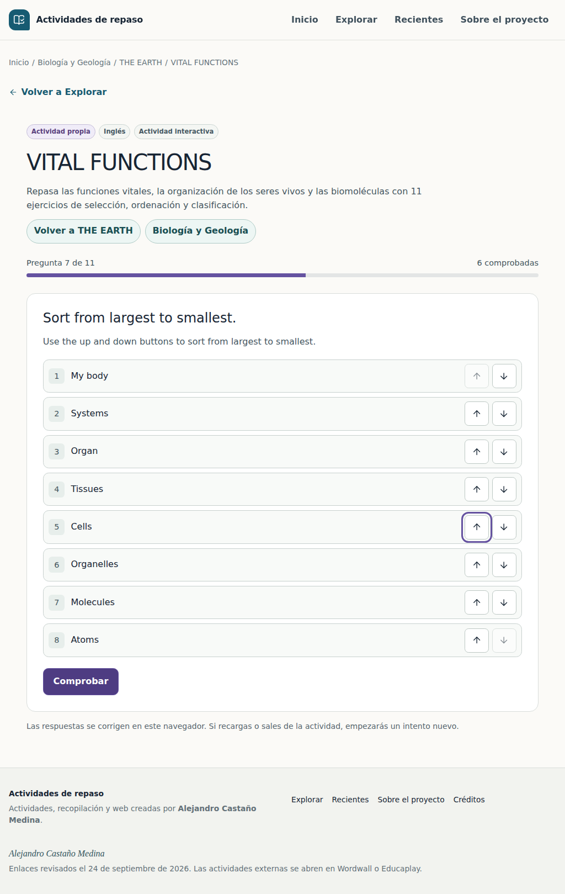

# VITAL FUNCTIONS

Integración sobre `main` a78290f7cb3bab2bd41d0f898e4463fa21034991.

## Catálogo y rutas

- Asignatura: **Biología y Geología**, ID y slug `biologia-geologia`; acento violeta `#6552A0`, icono Leaf.
- Tema: **THE EARTH**, ID `topic-biologia-geologia-the-earth`, slug `the-earth`.
- Actividad: **VITAL FUNCTIONS**, ID `native-vital-functions`, slug `vital-functions`.
- Tipo: **Actividad interactiva**, ID `actividad-interactiva`; idioma `en`; curso histórico 1.º ESO.
- Creación, incorporación y actualización: **2026-10-01**.
- Rutas: `/asignatura/biologia-geologia/`, `/asignatura/biologia-geologia/the-earth/`, `/actividad/vital-functions/`.

El Excel `data/catalogo-actividades.xlsx` conserva su esquema. Se añaden filas de asignatura, tema, tipo, actividad, relación y crédito; no se modifican celdas históricas. Los derivados se obtienen con `npm run catalog:generate`. Los 82 recursos externos existentes se conservan.

## Motor local

Se reutiliza el contrato existente `source.kind = native`, con `engineVersion = 1`, `activityType = mixed-practice` y `contentPath = data/native/vital-functions.json`. No hay plataforma ni URL externas.

`lib/native/load.ts` carga y valida el documento durante el build. Solo admite documentos JSON locales bajo `data/native/`, verifica motor, ID e idioma y entrega datos y estado inicial serializados al componente cliente. La exportación estática contiene todo lo necesario; jugar, corregir y repetir no requieren peticiones ni servidor. Se guardan las preguntas fuera del catálogo y del índice de búsqueda.

`lib/native/core.mjs` concentra validación, mezcla, corrección exacta y transiciones del intento. `lib/native/schema.ts` representa preguntas declarativas y respuestas. El renderer de `components/native/` se reutiliza para cualquier documento del mismo motor, sin comprobar títulos ni IDs de actividad.

Hay 11 ejercicios: 1 de selección múltiple, 7 de selección única, 1 de ordenación y 2 de clasificación (6 moléculas y 18 alimentos). Cada pregunta tiene explicación en inglés. Radios y checkboxes mantienen su semántica; ordenar usa botones de subir/bajar y clasificar usa selects nativos. Todos funcionan sin drag and drop y tienen targets táctiles de 44 px o mayores.

El flujo es responder → comprobar → revisar solución y explicación → continuar. Se bloquea la respuesta al corregir para impedir que cambie la puntuación. La pantalla final muestra todas las preguntas del intento, la respuesta del alumno, solución y explicación. Permite repetir todo o solo los errores. El progreso y la puntuación del repaso corresponden al nuevo intento. Se mezclan opciones y elementos; la ordenación nunca empieza resuelta.

Se conserva solo estado en memoria: recargar o salir empieza un intento nuevo, tal como indica la interfaz. No se crean cuentas ni se almacenan respuestas. La actividad es de solo lectura en el panel; UI, Worker y script de gestión lo indican y bloquean su edición/borrado. Los recursos externos siguen utilizando su formulario habitual.

## Fidelidad y aclaraciones del Markdown

La fuente íntegra se conserva en `data/native/sources/vital-functions.md`.

- P3: Nutrition and excretion aparece como correcta e incorrecta. Se conserva una única opción correcta.
- P6: Respiration aparece como correcta e incorrecta. Se conserva una única opción correcta.
- P7: **Mollecules → Molecules**, errata inequívoca.
- P10: **Nuclei acid → Nucleic acids**, corrección del nombre de las biomoléculas en la clasificación.
- P6 conserva la respuesta Respiration y el enunciado original. La nota y explicación aclaran que tomar oxígeno describe la respiración aerobia; algunos organismos utilizan procesos anaerobios. Referencia de comprobación: [OpenStax, Biology 2e, 7.5](https://openstax.org/books/biology-2e/pages/7-5-metabolism-without-oxygen).
- P8 conserva **Only in living things**, según la clave explícita. La explicación señala que es una simplificación del ejercicio: las moléculas orgánicas también pueden existir fuera de organismos vivos, por ejemplo en materia muerta. No se presenta la simplificación como una regla química universal.
- P11 conserva los grupos originales aunque los alimentos contienen mezclas. **meal** permanece en Proteins; el archivo no permite saber qué alimento se quiso nombrar. La nota visible advierte esta ambigüedad y no lo sustituye por otra palabra.

No se generan preguntas ni explicaciones durante la ejecución.

## Imagen

Se usa exclusivamente el JPG facilitado, convertido a WebP de 1600 × 1065 con calidad 88 y composición completa. Topic y miniatura de la actividad comparten el asset por herencia visual. Ruta: `public/images/topics/topic-biologia-geologia-the-earth.webp`.

El crédito enlaza **Imagen de tawatchai07 en Magnific** a la URL facilitada. El EXIF confirma la descripción “Earth and galaxy. Elements of this image furnished by NASA.” No se inventa una licencia: se indica que no está especificada en el material facilitado y se remite a la fuente.

## Verificación reproducible

```sh
npm ci
npm run catalog:check
git diff --exit-code -- data/generated/
npm test
npx tsc --noEmit
npm run lint
npx playwright install --with-deps chromium
npm run test:browser
```

Las pruebas de contenido cotejan todos los enunciados y opciones con el Markdown, además de claves y categorías. Las pruebas puras cubren los cuatro correctores, respuestas incompletas, puntuación, bloqueo, reset y modo de repaso. Las regresiones siguen verificando las 65 actividades y 11 temas originales de Ciencias, además de los 82 recursos externos de la fase anterior.

Las pruebas de navegador recorren sesiones correctas e incorrectas, revisión final, repetición, repaso de errores, selección con teclado, ordenación con teclado, clasificación, funcionamiento offline, Topic, búsqueda, Recientes, URL directa, recarga y vuelta atrás. Se ejecutan en escritorio, viewport iPad con touch y móvil con touch; son emulación en Chromium, no una prueba física de Safari/iPadOS. GitHub Actions conserva capturas e informe en `native-activity-browser-qa`.

## Resultado de QA

Las ejecuciones [32](https://github.com/t2wmt6sgff-glitch/Actividades-de-ciencias/actions/runs/36870705491) y [33](https://github.com/t2wmt6sgff-glitch/Actividades-de-ciencias/actions/runs/36870985781) pasaron catálogo, sincronización, build, 70 pruebas, TypeScript, lint y 9 pruebas de navegador. Se revisaron visualmente las capturas de entrada, ordenación, clasificación, Topic y resultados. Lint conserva una advertencia previa de `import/no-anonymous-default-export` en el Worker.

La prueba manual mediante el navegador de este entorno quedó bloqueada por `ERR_BLOCKED_BY_CLIENT` al abrir la dirección interna de la vista previa. Las sesiones completas se realizaron mediante las pruebas de navegador en CI. Antes de fusionar, conviene comprobar los selects y la ordenación en Safari del iPad físico.

Estas capturas de iPad corresponden al flujo ya validado; el informe de cada ejecución incluye además móvil, escritorio y la revisión de todas las preguntas.




